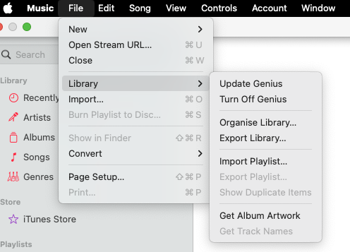

# Prerequisites
- install adb
  - see https://www.xda-developers.com/install-adb-windows-macos-linux/
  - and add `adb` to path
- install adbsync
```
pip install BetterADBSync
```
- npm install here
```
npm install
```

# Usage

First export the entire library in Music.app, to this directory under `tmp/Library.xml`

`File > Library > Export library...`



```sh
# cd to this directory
sh sync.sh "YourPlaylistName"
```